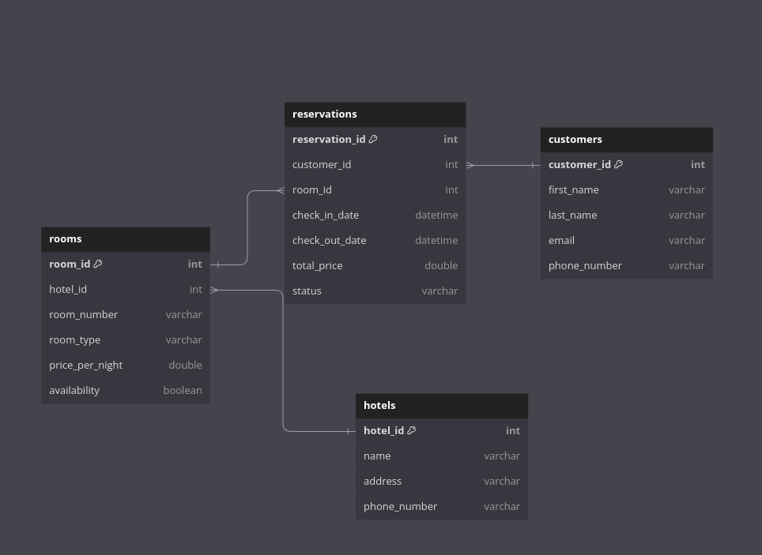

## App_HotelReservations
Es una aplicación de consola que permita realizar reservas, tiene como objetivo la automatizar la gestión de reservas. Esta aplicación permitirá a los usuarios realizar reservas de habitaciones a través de una interfaz de consola.

## Contexto del problema
La gestión manual de reservas de hotel puede ser compleja y propensa a errores. Los hoteles necesitan una solución que les permita gestionar las reservas de manera eficiente, evitando conflictos de disponibilidad y mejorando la experiencia del cliente. La automatización de este proceso reduce errores y aumenta la eficiencia.


## Análisis de requerimientos
Para desarrollar la aplicación de reservas de hotel, se deben considerar los siguientes requerimientos:

1. **Gestión de habitaciones**: La aplicación debe permitir la gestión de diferentes tipos de habitaciones y su disponibilidad.
2. **Reservas**: Los usuarios deben poder realizar, modificar y cancelar reservas.
3. **Clientes**: La aplicación debe gestionar la información de los clientes.


## Modelo Relacional
El modelo relacional de la aplicación de reservas de hotel se compone de las siguientes tablas:

### Tabla `hotels`
- **hotel_id**: Identificador único del hotel (Primary Key).
- **name**: Nombre del hotel.
- **address**: Dirección del hotel.
- **phone_number**: Número de teléfono del hotel.

### Tabla `rooms`
- **room_id**: Identificador único de la habitación (Primary Key).
- **hotel_id**: Identificador del hotel al que pertenece la habitación (Foreign Key que referencia a `hotels.hotel_id`).
- **room_number**: Número de la habitación.
- **room_type**: Tipo de habitación (por ejemplo, simple, doble, suite).
- **price_per_night**: Precio por noche de la habitación.
- **availability**: Disponibilidad de la habitación (booleano).

### Tabla `customers`
- **customer_id**: Identificador único del cliente (Primary Key).
- **first_name**: Nombre del cliente.
- **last_name**: Apellido del cliente.
- **email**: Correo electrónico del cliente.
- **phone_number**: Número de teléfono del cliente.

### Tabla `reservations`
- **reservation_id**: Identificador único de la reserva (Primary Key).
- **customer_id**: Identificador del cliente que realiza la reserva (Foreign Key que referencia a `customers.customer_id`).
- **room_id**: Identificador de la habitación reservada (Foreign Key que referencia a `rooms.room_id`).
- **check_in_date**: Fecha de entrada.
- **check_out_date**: Fecha de salida.
- **total_price**: Precio total de la reserva.
- **status**: Estado de la reserva (por ejemplo, confirmada, cancelada).



### Guía para Instalar y Usar la Aplicación

#### Requisitos
- Python
- MySQL

#### Pasos para la Instalación y Uso

1. **Clonar el Repositorio:**
   ```bash
   git clone https://github.com/mmaria145/HotelReservations.git
   cd HotelReservations
   ```

2. **Crear y Activar un Entorno Virtual:**
   ```bash
   python -m venv .venv
   source .venv/bin/activate  # En Windows usa: .venv\Scripts\activate
   ```

3. **Instalar las Librerías del Archivo `requirements.txt`:**
   ```bash
   pip install -r requirements.txt
   ```

4. **Crear el Archivo `.env`:**
   - Copiar el archivo `env.example` y renombrarlo a `.env`:
     ```bash
     cp .env.example .env
     ```

5. **Crear una Base de Datos en MySQL:**
   - Acceder a MySQL y crear la base de datos:
     ```sql
     CREATE DATABASE hotel;
     ```

6. **Configurar las Credenciales en el Archivo `.env`:**
   - Editar el archivo `.env` y poner las credenciales de la base de datos:
     ```dotenv
     DB_USER=tu_usuario
     DB_PASSWORD=tu_contraseña
     DB_HOST=localhost
     DB_PORT=3306
     DB_NAME=hotel
     ```

7. **Ejecutar la Aplicación:**
       Para ejecutar el script `app/main.py` desde la consola y asegurarte de que Python pueda encontrar el módulo `app`, sigue estos pasos:
    
     Activa tu entorno virtual `.venv`.
     Ajusta el `PYTHONPATH` para incluir el directorio del proyecto.
     Ejecuta el script.
    
    ```bash
    source .venv/bin/activate  # Activa el entorno virtual
    PYTHONPATH=. python app/main.py  # Ajusta el PYTHONPATH y ejecuta el script
    ```
    
    En Windows, los comandos para activar el entorno virtual y ajustar el `PYTHONPATH` serían:

    ```bash
    .venv\Scripts\activate  # Activa el entorno virtual
    set PYTHONPATH=. && python app\main.py  # Ajusta el PYTHONPATH y ejecuta el script
    ```


Con estos pasos, tu aplicación debería estar lista para usarse.
